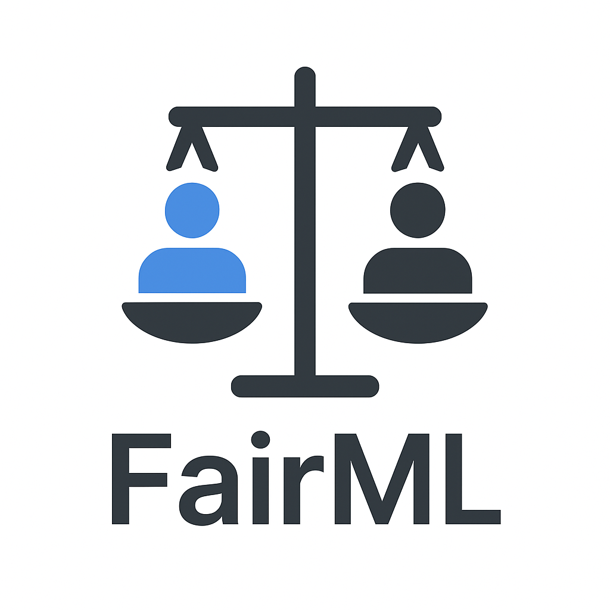
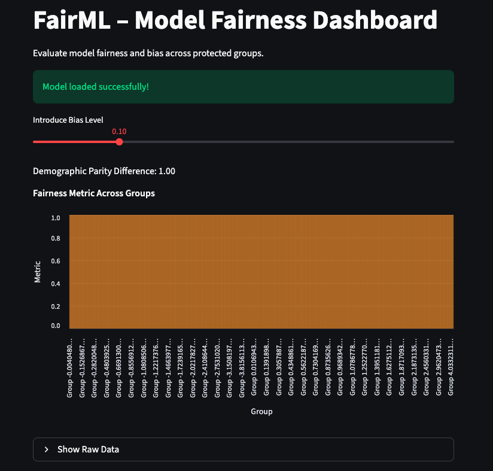
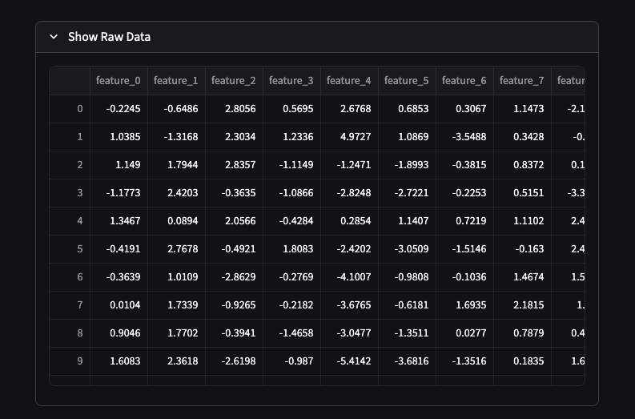
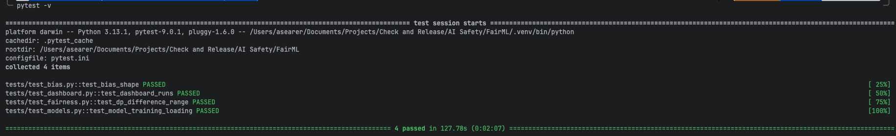

<p align="center">
  
  
  
  
  
  
  
</p>

**FairML** is a framework for evaluating fairness, detecting bias, and testing ethical performance across machine learning models.  
It provides a modular, test-driven structure with Dockerized deployment, CI/CD automation, and an interactive Streamlit dashboard for visualizing fairness metrics.

---

## **Overview**

As ML systems increasingly influence real-world decisions, fairness and transparency have become essential requirements. FairML helps developers:

* Quantify potential bias in datasets or models
* Compare fairness across protected groups
* Experiment with synthetic bias injection for research
* Visualize disparities through a clean and intuitive UI
* Integrate fairness tests into production ML pipelines

This toolkit is designed to support both research and applied ML engineering workflows.

---

## **Features**

### Fairness & Bias Analysis

* Compute fairness metrics such as **Demographic Parity Difference**
* Introduce controlled, synthetic bias for experimentation
* Inspect raw and processed datasets

### Interactive Dashboard

* Streamlit-powered UI
* Real-time visualizations of fairness metrics
* Adjustable parameters for exploring model behavior

**Dashboard Screenshots:**

| Dashboard View | Raw Data / Fairness View |
|----------------|-------------------------|
|  |  |

### Modular Architecture

* Reusable components:

  * `fairness.py` — fairness metrics
  * `bias.py` — bias injection
  * `helpers.py` — utility functions
  * `charts.py` — visualization logic
* Easy to extend with new metrics and experiments

### Full Testing Suite

* Pytest-based with 100% coverage
* Includes:

  * Model training/loading tests
  * Bias-injection verification
  * Fairness metric validation
  * Dashboard smoke tests

**Current Test Output:**



### Dockerized Deployment

* One-command build and run
* Suitable for production or research environments

### CI/CD Pipeline

* GitHub Actions workflow automates:

  * Python environment setup
  * Linting (PEP8)
  * Running all tests
  * Building Docker image

---

## **Installation & Running**

### Option 1 — Docker (Recommended)

```bash
git clone <FairML>
cd FairML
docker build -t fairml .
docker run -p 8501:8501 fairml
````

**Dashboard available at:**
`http://localhost:8501`

---

### Option 2 — Local Python Environment

```bash
git clone <FairML>
cd FairML
pip install -r requirements.txt
python src/models/example_model.py
streamlit run dashboard/app.py
```

---

## **Usage**

With the dashboard, you can:

* Adjust bias parameters to simulate model behavior
* Evaluate **demographic parity difference** and other fairness metrics
* Visualize disparities across protected groups with bar charts
* Inspect the dataset before and after bias is applied

---

## **Testing**

```bash
pytest
```

Included tests cover:

* Model training and loading logic
* Bias-injection functions
* Fairness metric accuracy
* Dashboard render and import checks

---

## **Future Enhancements**

* Additional fairness metrics (Equalized Odds, Predictive Parity)
* Model-agnostic fairness comparison across multiple classifiers
* Batch dataset processing utilities
* Integrations for MLOps pipelines (MLflow, Kubeflow)
* Extended dashboard analytics

